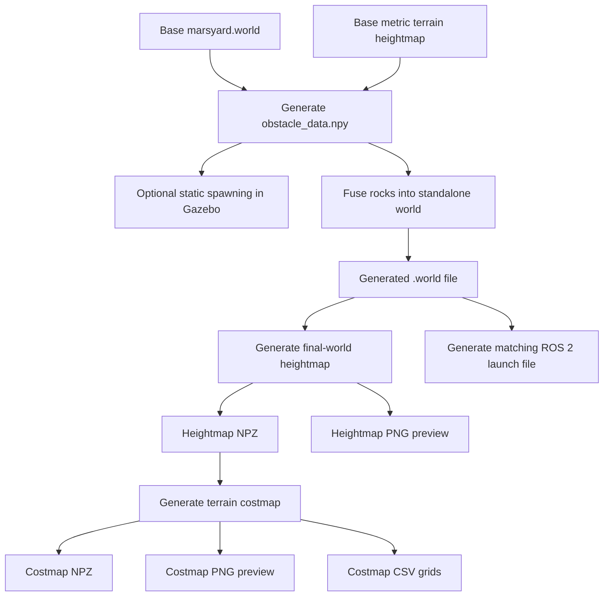

# ROAR Rock Generator, World Dataset, Heightmap & Costmap Pipeline

The `rock_generator` package is a modular ROS 2 Humble package for generating repeatable Mars Yard simulation datasets.

It can:

1. Generate rock-placement datasets from a metric terrain heightmap.
2. Place rocks only on valid rough terrain at their real surface elevation.
3. Spawn generated rocks in a running Gazebo simulation.
4. Fuse the generated rocks into a standalone Gazebo `.world` file.
5. Generate a metric heightmap for the final world, including the terrain and rocks.
6. Convert the heightmap into directional and total traversal costmaps.
7. Create a matching ROS 2 launch file.
8. Store every generated scenario in an isolated, automatically numbered dataset folder.

---

## 1. System Overview

```text
Base Mars Yard Heightmap
          ↓
Generate Obstacle Data
          ↓
Fuse Obstacles into a New World
          ↓
Generate Final-World Heightmap
          ↓
Generate Terrain Costmap
          ↓
Generate ROS 2 Launch File
          ↓
Save Everything in world_001, world_002, ...
```



---

## 2. Repository Location

```text
navMission_setup/rock_generator
```

Typical workspace root:

```text
~/new_sim_tes/ROAR-26-Simulation
```

---

## 3. Generated Dataset Structure

Every successful world generation creates a new numbered folder:

```text
marsyards/worlds/generated_worlds/
├── world_001/
├── world_002/
├── world_003/
└── ...
```

Each run is stored independently:

```text
world_001/
├── metadata.txt
├── obstacle_data/
│   ├── obstacle_data.npy
│   └── obstacle_data_info.txt
├── world/
│   └── w_d0.034_c0.71.world
├── heightmap/
│   ├── w_d0.034_c0.71_heightmap.npz
│   └── w_d0.034_c0.71_heightmap.png
└── costmap/
    ├── w_d0.034_c0.71_costmap.npz
    ├── w_d0.034_c0.71_costmap.png
    └── csv/
        ├── cost_x.csv
        ├── cost_y.csv
        └── total_cost.csv
```

The matching launch file is stored in:

```text
marsyards/worlds/launch/w_d0.034_c0.71.launch.py
```

The launch file points to the nested generated world file inside:

```text
marsyards/worlds/generated_worlds/world_001/world/
```

### Run numbering

Run folders are created automatically:

```text
world_001
world_002
world_003
...
```

### Generated world filename

The `.world` filename uses the measured scenario statistics:

```text
w_d{actual_density}_c{actual_collidable_ratio}.world
```

Example:

```text
w_d0.034_c0.71.world
```

`d0.034` is the actual generated density and `c0.71` is the actual collidable-rock ratio. These values can differ slightly from the requested values because the generator works with an integer number of rocks.

---

## 4. Current Package Structure

```text
navMission_setup/rock_generator/
├── launch/
│   ├── launch_world.launch.py
│   ├── rock_generator.launch.py
│   └── visualize_rocks.launch.py
├── obs_data/
│   └── legacy or manually generated obstacle datasets
├── rock_generator/
│   ├── __init__.py
│   ├── generator.py
│   ├── spawner.py
│   ├── world_generator.py
│   ├── main.py
│   └── maps_tools/
│       ├── __init__.py
│       ├── heightmap/
│       │   ├── __init__.py
│       │   ├── heightmap_generator.py
│       │   ├── visualize_heightmap.py
│       │   ├── HEIGHTMAP_TASK.md
│       │   └── data/
│       │       ├── marsyard_heightmap.npz
│       │       └── marsyard_heightmap_preview.png
│       └── costmap/
│           ├── __init__.py
│           └── costmap_generator.py
├── rocks_ws/
│   ├── rock_1/
│   ├── rock_2/
│   ├── ...
│   └── rock_9/
├── package.xml
├── setup.py
├── setup.cfg
└── README.md
```

---

## 5. Main Components

### `generator.py`

Generates obstacle-placement data using the base Mars Yard metric heightmap.

The default heightmap is located at:

```text
rock_generator/maps_tools/heightmap/data/marsyard_heightmap.npz
```

The generator:

- Loads the metric elevation grid.
- Rejects invalid or unknown terrain cells.
- Rejects terrain below the minimum accepted elevation.
- Rejects terrain that is too flat when rough-terrain filtering is enabled.
- Samples rock positions inside the configured Mars Yard bounds.
- Enforces minimum spacing between rock centers.
- Assigns random rock models and orientations.
- Marks each rock as collidable or non-collidable.
- Saves the result as a NumPy `.npy` dataset.

### `spawner.py`

Reads an obstacle dataset and spawns rock models into an already running Gazebo simulation. It is intended for visual inspection and placement validation.

### `world_generator.py`

This is the main dataset-building component. It:

1. Reads a clean base world.
2. Reads an obstacle `.npy` dataset.
3. Calculates actual density and collidable ratio.
4. Creates the next numbered run folder.
5. Copies the obstacle dataset into that run.
6. Writes a standalone generated `.world` file.
7. Runs the final-world heightmap generator.
8. Runs the costmap generator.
9. Writes run metadata.
10. Generates a matching ROS 2 launch file.

### `maps_tools/heightmap/heightmap_generator.py`

Generates a metric elevation map from the final world, including the Mars Yard terrain and all generated rocks.

Outputs:

```text
*_heightmap.npz
*_heightmap.png
```

Common NPZ fields:

```text
grid
xs
ys
resolution
origin_x
origin_y
world_path
geometry_count
```

The PNG is a preview only. The NPZ contains the real metric data.

### `maps_tools/costmap/costmap_generator.py`

Converts the metric heightmap into directional and total terrain traversal costs.

It calculates:

```text
gradient_x
gradient_y
gradient_magnitude
laplacian
cost_x
cost_y
total
```

Cost interpretation:

```text
0      = very low traversal cost
1–99   = increasing traversal difficulty
100    = maximum terrain cost
-1     = unknown or outside valid terrain
```

Outputs:

```text
*_costmap.npz
*_costmap.png
csv/cost_x.csv
csv/cost_y.csv
csv/total_cost.csv
```

> The total-cost array inside the NPZ file is stored under the key `total`.

---

## 6. ROS 2 Executables

```bash
ros2 pkg executables rock_generator
```

Expected executables:

```text
rock_generator generate_obs
rock_generator generate_world
rock_generator generate_heightmap
rock_generator generate_costmap
rock_generator spawn_rocks
rock_generator rock_generator
```

---

# 7. Installation and Build

```bash
cd ~/new_sim_tes/ROAR-26-Simulation

source /opt/ros/humble/setup.bash

colcon build --symlink-install \
  --packages-select marsyard worlds rock_generator

source install/setup.bash
```

Verify:

```bash
ros2 pkg executables rock_generator
```

---

# 8. Recommended Complete Workflow

## Step 1 — Source the workspace

```bash
cd ~/new_sim_tes/ROAR-26-Simulation

source /opt/ros/humble/setup.bash
source install/setup.bash
```

## Step 2 — Generate obstacle data

```bash
ros2 run rock_generator generate_obs \
  --world-name marsyard.world \
  --density 0.034 \
  --collidable-ratio 0.60 \
  --spacing 1.0 \
  -o /tmp/new_world_obstacle_data.npy
```

## Step 3 — Generate the complete world dataset

```bash
ros2 run rock_generator generate_world \
  -i /tmp/new_world_obstacle_data.npy \
  -w marsyard.world
```

This command performs:

```text
Copy obstacle dataset
→ Create world_XXX folder
→ Generate standalone world
→ Generate heightmap
→ Generate costmap
→ Generate CSV files
→ Generate launch file
→ Save metadata
```

## Step 4 — Inspect the output

```bash
tree marsyards/worlds/generated_worlds/world_001
```

List all generated runs:

```bash
ls -lh marsyards/worlds/generated_worlds/
```

Find the newest run:

```bash
LATEST_RUN=$(find marsyards/worlds/generated_worlds \
  -maxdepth 1 \
  -type d \
  -name "world_*" \
  -printf "%f\n" \
  | sort \
  | tail -n 1)

echo "$LATEST_RUN"
```

## Step 5 — Open generated previews

```bash
xdg-open \
  marsyards/worlds/generated_worlds/world_001/heightmap/w_d0.034_c0.71_heightmap.png
```

```bash
xdg-open \
  marsyards/worlds/generated_worlds/world_001/costmap/w_d0.034_c0.71_costmap.png
```

---

# 9. Launching a Generated World in Gazebo

## Important

A generated launch file is written into the source `worlds` package:

```text
marsyards/worlds/launch/
```

ROS 2 launches packages from the workspace `install/` directory. Therefore, after generating a new launch file, rebuild the `worlds` package before launching it.

## Launch a known generated world

Open a new terminal:

```bash
cd ~/new_sim_tes/ROAR-26-Simulation

source /opt/ros/humble/setup.bash

colcon build --symlink-install \
  --packages-select worlds

source install/setup.bash

ros2 launch worlds w_d0.034_c0.71.launch.py
```

Replace the launch filename with the one printed by `generate_world`.

## Launch the newest generated world automatically

```bash
cd ~/new_sim_tes/ROAR-26-Simulation

source /opt/ros/humble/setup.bash

colcon build --symlink-install \
  --packages-select worlds

source install/setup.bash

LATEST_LAUNCH=$(find marsyards/worlds/launch \
  -maxdepth 1 \
  -type f \
  -name "w_d*_c*.launch.py" \
  -printf "%T@ %f\n" \
  | sort -nr \
  | head -n 1 \
  | cut -d' ' -f2-)

echo "Launching in Gazebo: $LATEST_LAUNCH"

ros2 launch worlds "$LATEST_LAUNCH"
```

Confirm ROS 2 can see the launch file:

```bash
ls install/worlds/share/worlds/launch/
```

---

# 10. Launching the Clean Base World

```bash
cd ~/new_sim_tes/ROAR-26-Simulation

source /opt/ros/humble/setup.bash
source install/setup.bash

ros2 launch worlds launch_map.launch.py \
  world:=marsyard.world
```

The clean `marsyard.world` remains unchanged and is used as the template for all generated scenarios.

---

# 11. Optional Live Gazebo Spawning Workflow

## Terminal 1 — Launch the clean world

```bash
cd ~/new_sim_tes/ROAR-26-Simulation

source /opt/ros/humble/setup.bash
source install/setup.bash

ros2 launch worlds launch_map.launch.py \
  world:=marsyard.world
```

## Terminal 2 — Generate and spawn rocks

```bash
cd ~/new_sim_tes/ROAR-26-Simulation

source /opt/ros/humble/setup.bash
source install/setup.bash

ros2 run rock_generator rock_generator \
  --world-name marsyard.world \
  --density 0.025 \
  --collidable-ratio 0.60 \
  --spacing 1.0
```

The unified executable currently generates obstacle data and spawns rocks in the active simulator. Use `generate_world` to create the complete saved dataset.

---

# 12. Generate a Heightmap Manually

```bash
ros2 run rock_generator generate_heightmap \
  /absolute/path/to/generated.world \
  -o /tmp/test_heightmap.npz \
  --preview /tmp/test_heightmap.png
```

Example:

```bash
ros2 run rock_generator generate_heightmap \
  "$PWD/marsyards/worlds/generated_worlds/world_001/world/w_d0.034_c0.71.world" \
  -o /tmp/test_heightmap.npz \
  --preview /tmp/test_heightmap.png
```

Inspect:

```bash
ls -lh /tmp/test_heightmap.*
xdg-open /tmp/test_heightmap.png
```

---

# 13. Generate a Costmap Manually

```bash
ros2 run rock_generator generate_costmap \
  /absolute/path/to/heightmap.npz \
  -o /tmp/test_costmap.npz \
  --preview /tmp/test_costmap.png \
  --csv-dir /tmp/test_costmap_csv
```

Example:

```bash
ros2 run rock_generator generate_costmap \
  "$PWD/marsyards/worlds/generated_worlds/world_001/heightmap/w_d0.034_c0.71_heightmap.npz" \
  -o /tmp/test_costmap.npz \
  --preview /tmp/test_costmap.png \
  --csv-dir /tmp/test_costmap_csv
```

Optional tuning:

```bash
ros2 run rock_generator generate_costmap \
  /path/to/heightmap.npz \
  -o /path/to/costmap.npz \
  --preview /path/to/costmap.png \
  --csv-dir /path/to/csv \
  --gradient-scale 150 \
  --stability-scale 90
```

---

# 14. Parameters

## Obstacle generation

| Parameter | CLI flag | Default | Description |
|---|---|---:|---|
| World name | `--world-name` | `marsyard.world` | Base Gazebo world |
| Density | `--density` | `0.012` | Requested rocks per square metre |
| Collidable ratio | `--collidable-ratio`, `-c` | `0.5` | Requested fraction of collidable rocks |
| Spacing | `--spacing`, `-s` | `1.0` | Minimum distance between rock centers |
| Minimum roughness | `--min-roughness` | `0.02` | Minimum local height variation |
| Minimum terrain height | `--min-terrain-height` | `0.15` | Minimum accepted terrain elevation |
| Dead ends | `--deadends` | Disabled | Enables barrier-like formations |
| Heightmap override | `--heightmap` | Auto | Custom heightmap NPZ |
| Output dataset | `--output`, `-o` | Package default | Obstacle-data output path |

## World generation

| Parameter | CLI flag | Default | Description |
|---|---|---:|---|
| Input dataset | `--input`, `-i` | Required | Obstacle `.npy` dataset |
| Base world | `--world`, `-w` | `marsyard.world` | Clean world template |
| Output world | `--output`, `-o` | Auto | Optional manual world path |
| Density override | `--density` | Calculated | Optional override |
| Collidable override | `--collidable-ratio` | Calculated | Optional override |
| Heightmap resolution | `--heightmap-resolution` | `0.25` | Metres per cell |
| Skip heightmap | `--skip-heightmap` | Disabled | Generate the world only |
| Skip costmap | `--skip-costmap` | Disabled | Generate world and heightmap only |
| Heightmap output | `--heightmap-output` | Auto | Optional manual NPZ path |
| Costmap output | `--costmap-output` | Auto | Optional manual NPZ path |

---

# 15. Output Data Reference

## Metadata

Each run contains `metadata.txt`, including:

```text
Run ID
World filename
Actual density
Actual collidable ratio
Total obstacles
Base world path
Source obstacle dataset
```

## Heightmap NPZ

| Field | Meaning |
|---|---|
| `grid` | Elevation grid in metres |
| `xs` | World X coordinates |
| `ys` | World Y coordinates |
| `resolution` | Metres per cell |
| `origin_x` | Grid origin X |
| `origin_y` | Grid origin Y |
| `world_path` | Source generated world |
| `geometry_count` | Processed geometry count |

## Costmap NPZ

| Field | Meaning |
|---|---|
| `total` | Combined traversal cost |
| `cost_x` | Directional traversal cost in X |
| `cost_y` | Directional traversal cost in Y |
| `gradient_x` | Height derivative in X |
| `gradient_y` | Height derivative in Y |
| `gradient_magnitude` | Combined local slope |
| `laplacian` | Local surface variation |
| `resolution` | Metres per cell |
| `origin_x` | Costmap origin X |
| `origin_y` | Costmap origin Y |
| `heightmap_path` | Source heightmap path |
| `gradient_scale` | Slope contribution scale |
| `stability_scale` | Surface variation scale |

---

# 16. Useful Inspection Commands

List generated datasets:

```bash
find marsyards/worlds/generated_worlds \
  -maxdepth 1 \
  -type d \
  -name "world_*" \
  | sort
```

Inspect the newest run:

```bash
LATEST_RUN=$(find marsyards/worlds/generated_worlds \
  -maxdepth 1 \
  -type d \
  -name "world_*" \
  -printf "%f\n" \
  | sort \
  | tail -n 1)

tree "marsyards/worlds/generated_worlds/$LATEST_RUN"
```

List generated launch files:

```bash
ls -lt marsyards/worlds/launch/
```

Inspect NPZ keys:

```bash
python3 - <<'PY'
import numpy as np

path = "path/to/map.npz"
data = np.load(path)

for key in data.files:
    print(key)
PY
```

---

# 17. Troubleshooting

## Package not found

```text
Package 'rock_generator' not found
```

```bash
source /opt/ros/humble/setup.bash
source ~/new_sim_tes/ROAR-26-Simulation/install/setup.bash
```

## Generated launch file not found

```text
file 'w_d0.034_c0.71.launch.py' was not found in the share directory
```

```bash
cd ~/new_sim_tes/ROAR-26-Simulation

source /opt/ros/humble/setup.bash

colcon build --symlink-install \
  --packages-select worlds

source install/setup.bash
```

## Heightmap or costmap command is missing

```bash
ros2 pkg executables rock_generator
```

Then rebuild:

```bash
rm -rf build/rock_generator install/rock_generator

source /opt/ros/humble/setup.bash

colcon build --symlink-install \
  --packages-select rock_generator

source install/setup.bash
```

## Build error involving `__pycache__`

```bash
find navMission_setup/rock_generator \
  -type d \
  -name "__pycache__" \
  -prune \
  -exec rm -rf {} +

find navMission_setup/rock_generator \
  -type f \
  -name "*.pyc" \
  -delete
```

Then clean and rebuild.

## Partially generated run folder

Inspect it:

```bash
tree marsyards/worlds/generated_worlds/world_001
```

Delete only if it is incomplete:

```bash
rm -rf marsyards/worlds/generated_worlds/world_001
```

## Wrong workspace sourced automatically

Inspect:

```bash
nano ~/.bashrc
```

Remove or comment invalid lines such as:

```bash
source /old/workspace/install/setup.bash
```

Reload:

```bash
source ~/.bashrc
```

---

# 18. Legacy Output Cleanup

The previous layout stored generated files directly under:

```text
marsyards/worlds/worlds/
```

After verifying the numbered dataset system, remove legacy generated outputs while keeping the clean base world:

```bash
cd ~/new_sim_tes/ROAR-26-Simulation

rm -rf marsyards/worlds/worlds/heightmaps
rm -rf marsyards/worlds/worlds/costmaps

find marsyards/worlds/worlds \
  -maxdepth 1 \
  -type f \
  -name "w_d*_c*.world" \
  -delete
```

Confirm:

```bash
ls -lh marsyards/worlds/worlds/
```

Expected:

```text
marsyard.world
```

Do not delete the clean base world.

---

# 19. Design Notes

- `marsyard.world` remains the clean reusable template.
- Every generated scenario is isolated in its own `world_XXX` folder.
- The obstacle dataset used for a world is stored with that world.
- Heightmaps are generated from the final fused world.
- Costmaps are generated from metric NPZ heightmaps.
- PNG files are previews only.
- Unknown cells use cost `-1`.
- Traversal cost is clipped to `0–100`.
- The world filename reports actual density and collidable ratio.
- The run-folder number identifies the generation sequence.
- Launch files remain under the `worlds` package for ROS 2 discovery.
- Rebuilding the `worlds` package is required after generating a new launch file.

---

# 20. Quick Command Reference

## Build everything

```bash
cd ~/new_sim_tes/ROAR-26-Simulation
source /opt/ros/humble/setup.bash
colcon build --symlink-install \
  --packages-select marsyard worlds rock_generator
source install/setup.bash
```

## Generate obstacle data

```bash
ros2 run rock_generator generate_obs \
  --world-name marsyard.world \
  --density 0.034 \
  --collidable-ratio 0.60 \
  --spacing 1.0 \
  -o /tmp/new_world_obstacle_data.npy
```

## Generate the complete dataset

```bash
ros2 run rock_generator generate_world \
  -i /tmp/new_world_obstacle_data.npy \
  -w marsyard.world
```

## Rebuild generated launch files

```bash
colcon build --symlink-install \
  --packages-select worlds
source install/setup.bash
```

## Launch a generated world

```bash
ros2 launch worlds w_d0.034_c0.71.launch.py
```

## Launch the newest generated world

```bash
LATEST_LAUNCH=$(find marsyards/worlds/launch \
  -maxdepth 1 \
  -type f \
  -name "w_d*_c*.launch.py" \
  -printf "%T@ %f\n" \
  | sort -nr \
  | head -n 1 \
  | cut -d' ' -f2-)

ros2 launch worlds "$LATEST_LAUNCH"
```

---

## License

MIT

## Maintainers

ROAR Simulation Team
