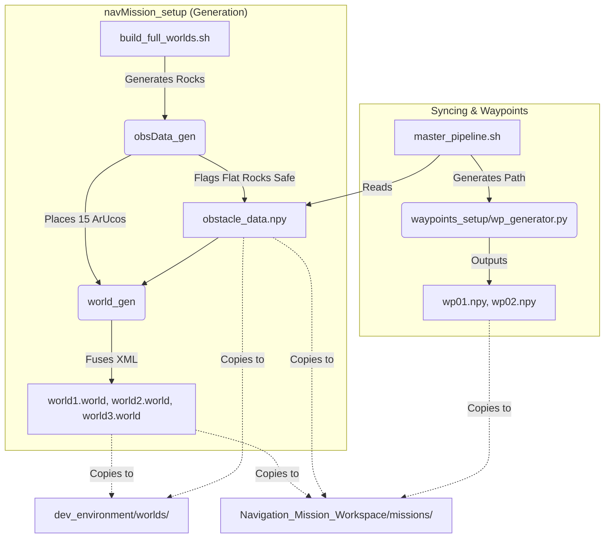

# Navigation Mission Setup (`navMission_setup`)

This package provides a fully automated pipeline for generating parameterized Mars Yard environments for simulation testing. It generates random obstacle configurations (rocks), computes safe-collision logic, places ArUco markers, and syncs everything seamlessly to the evaluation workspace.

---

## 🗺️ Pipeline Flow Overview

The orchestrator scripts `build_full_worlds.sh` and `master_pipeline.sh` manage the entire lifecycle of world generation and syncing.



---

## 🚀 How to Generate New Worlds

To wipe the existing layouts and generate completely fresh randomized rocks and ArUco markers for all 3 worlds, run the world builder script:

```bash
bash build_full_worlds.sh
```

**What this does:**
1. Triggers `obsData_gen` for World 1 (8 rocks), World 2 (50 rocks), and World 3 (90 rocks).
2. Uses the physics size of each rock mesh to flag it as Collidable or Non-Collidable (Meshes 5, 6, 7, 8, 9 are hardcoded as safe).
3. Places 15 ArUco markers in each world.
4. Fuses these assets into the `marsyard.world` template.
5. Pushes the newly created datasets into `../dev_environment/worlds/` for testing.

---

## 🚀 How to Sync Worlds to the Navigation Engine

Once you have tested the worlds in the `dev_environment` and are satisfied with the layout, you must generate the waypoint paths and sync the assets to the headless evaluation engine.

```bash
bash master_pipeline.sh
```

**What this does:**
1. Scans `dev_environment` for the newly generated `obstacle_data.npy`.
2. Passes the data to `wp_generator.py`, which computes collision-free trajectories for the rover.
3. Copies the `.world` files, the `obstacle_data.npy`, the `aruco_data.yaml`, and the `wpXX.npy` path files directly into `Navigation_Mission_Workspace/missions/`.

---

## 📁 Master Outputs Directory Layout (Navigation Workspace)

After running `master_pipeline.sh`, the evaluation workspace will look like this:

```text
Navigation_Mission_Workspace/missions/mission_{index}/
├── marsyard.world             # Standalone Gazebo world with fused rocks & ArUcos
├── waypoints/
│   ├── wp01.npy               # Generated mission waypoint path
│   └── wp02.npy               # Generated mission waypoint path
└── assets/
    ├── obstacle_data.npy      # NumPy coordinates of placed rocks
    └── aruco_data.yaml        # ArUco marker coordinates
```

---

## 🧹 Cleaning Behavior
Both `build_full_worlds.sh` and `master_pipeline.sh` automatically clean up stale inputs and outputs before generating new ones. You do not need to manually delete old world files before running the pipeline.
