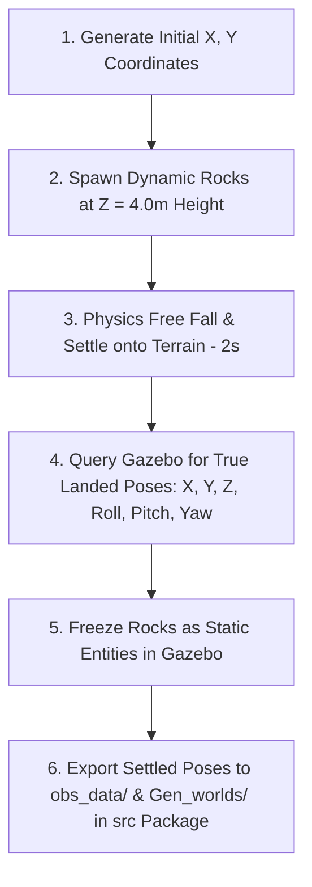

# ROAR Rock Generator, Spawner & World Fuser Package (`rock_generator`)

`rock_generator` is a modular ROS 2 package located in `simulation_ws/src/navMission_setup/rock_generator` designed for:
1. Generating obstacle datasets in NumPy (`.npy`) format.
2. Spawning dynamic rock models into Gazebo, letting gravity drop and settle them onto terrain mesh contours.
3. Capturing and exporting the **exact landed 3D poses ($X, Y, Z, \text{Roll}, \text{Pitch}, \text{Yaw}$)** back into `obs_data/` and `Gen_worlds/` inside the package source repository (`src/`).
4. Fusing obstacle datasets with base Gazebo world templates from the **`worlds`** package (`marsyard.world`) into standalone ready-to-use `.world` files in `Gen_worlds/`.

---

## 🌟 Settled Physics-Capture Workflow

Because exact ground heightmap data may not always be available initially, `rock_generator` uses a **Physics-Based Settling & Pose Capture** strategy:



1. **Initial Air Drop**: Rocks spawn dynamically at $Z=4.0\text{ m}$ height above the terrain.
2. **Free Fall & Settlement**: Physics runs for 2 seconds under gravity. Rocks fall, land on terrain mesh contours, and settle into their natural resting positions.
3. **Pose Capture & Freeze**: The spawner queries Gazebo for the exact settled position and orientation $(X_{\text{settled}}, Y_{\text{settled}}, Z_{\text{settled}}, \text{Roll}_{\text{settled}}, \text{Pitch}_{\text{settled}}, \text{Yaw}_{\text{settled}})$, freezes models as static entities in simulation, and **overwrites the initial dataset with true landed coordinates**.
4. **Source Directory Export**: Automatically saves updated datasets to:
   - `obs_data/obstacle_data.npy` *(Updated with exact landed Z, Roll, Pitch, Yaw)*
   - `obs_data/obstacle_data_settled_YYYYMMDD_HHMMSS.npy` *(Timestamped dataset)*
   - `Gen_worlds/marsyard_with_rocks.world` *(Fused world with exact settled poses)*
   - `Gen_worlds/marsyard_rocks_YYYYMMDD_HHMMSS.world` *(Timestamped fused world)*

---

## 🗺️ Height Map & Parameterized World Workflow

The package uses a **Height Map (Elevation Grid) Sampling** strategy combined with **Dynamic Standalone World & Launch Generation** inside the `worlds` package:

```mermaid
graph TD
    A[1. Launch Plain World] -->|Start Gazebo with marsyard.world| B(Active Simulation)
    C[2. Sampling Heightmap] -->|Read terrain elevations & generate rock coordinates| D[3. Save to obs_data/obstacle_data.npy]
    D -->|Read coordinates| E[4. Spawn Rocks in Simulator]
    E -->|Spawn models at exact Z coordinates| B
    D -->|Read coordinates| F[5. Fuse World File]
    F -->|Merge marsyard.world + coordinates| G[w_d{density}_c{collidable_ratio}.world]
    G -->|Generate Launch File| H[w_d{density}_c{collidable_ratio}.launch.py]
```

1. **Step 1: Open the Plain World**: Gazebo is launched with the plain, clean `marsyard.world` (which contains no rocks).
2. **Step 2: Generate Rock Placements**: The generator script reads the world heightmap (`marsyard_heightmap.npz`) to find the exact ground elevation ($Z$ coordinates) of rough terrain areas. It selects $N$ random positions based on your target density.
3. **Step 3: Save to `obs_data`**: The generator saves these generated rock coordinates directly to the source folder: `navMission_setup/rock_generator/obs_data/obstacle_data.npy`.
4. **Step 4: Spawn Rocks in Simulator**: The spawner reads the generated coordinates from `obstacle_data.npy` and spawns the rock models statically at their true ground heights directly in your active Gazebo window so you can visualize them.
5. **Step 5: Fuse and Save Standalone World**: The fuser parses your clean `marsyard.world` and appends all the rock coordinates from `obstacle_data.npy` to write a brand new world file under the `worlds` package:
   `marsyards/worlds/worlds/w_d{density}_c{collidable_ratio}.world`
6. **Step 6: Generate Launch File**: It writes a matching launch script under `worlds/launch/w_d{density}_c{collidable_ratio}.launch.py` so you can launch or share that exact rock configuration directly at any time.

This ensures the base `marsyard.world` file always remains **clean and rock-free**, while every run generates a distinct, retrievable simulation setup.


---

## 🛠️ Package Parameters

| Parameter | CLI Flag | Default | Description |
| :--- | :--- | :--- | :--- |
| `world_name` | `--world-name` / `-w` | `marsyard.world` | Target Gazebo world file from `worlds` package |
| `density` | `--density` | `0.012` | Rock density in rocks per square meter |
| `collidable_ratio` | `--collidable-ratio` / `-c` | `0.5` | Ratio (0.0 to 1.0) of solid/collidable vs ghost/non-collidable rocks |
| `spacing` | `--spacing` / `-s` | `1.0` | Minimum physical distance (meters) between rock centers |
| `deadends` | `--deadends` | `False` | Enables barrier rock formation creating deadends |
| `obs_data_path` | `--obs-data-path` / `-o` | `obs_data/obstacle_data.npy` | Path for `.npy` obstacle dataset input/output |

---

## 🚀 Installation & Build Steps

From workspace root (`simulation_ws`):

```bash
cd ~/Desktop/ROAR/simulation_ws/
colcon build --packages-select marsyard worlds rock_generator
source install/setup.bash
```

---

## 💻 Workflows & Commands

### Workflow 1: Launch the Clean Plain World
Always start by launching the plain world (without rocks) to act as the active simulator instance:
```bash
ros2 launch worlds launch_map.launch.py world:=marsyard.world
```

---

### Workflow 2: Generate Obstacles & Spawn Statically in Gazebo (Unified Execution)
With the plain world running, launch the unified rock generator. It reads the terrain heightmap, generates random placements on rough terrain, saves them to `obs_data/`, spawns them statically in Gazebo, and automatically fuses them into a new world configuration:
```bash
ros2 run rock_generator rock_generator --world-name marsyard.world --density 0.025 --collidable-ratio 0.6
```
This single command automatically executes:
1. **Generation**: Saves placements to `navMission_setup/rock_generator/obs_data/obstacle_data.npy`.
2. **Visual Spawning**: Instantly renders the models statically in Gazebo at ground height.
3. **World Fusion & Launch Generation**: Creates a parameterized `.world` and matching `.launch.py` inside the `worlds` package.

---

### Workflow 3: Manual World Fusing (Optional)
If you already have an `obstacle_data.npy` file and want to manually fuse it with the base world:
```bash
ros2 run rock_generator generate_world -i navMission_setup/rock_generator/obs_data/obstacle_data.npy -w marsyard.world
```

---

### Workflow 4: Launch Fused Parameterized World
To run a pre-generated world configuration:
1. Recompile the workspace to register the new launch and world files:
   ```bash
   colcon build
   source install/setup.bash
   ```
2. Launch your custom configuration directly:
   ```bash
   ros2 launch worlds w_d{density}_c{collidable_ratio}.launch.py
   ```
   *(For example: `ros2 launch worlds w_d0.026_c0.50.launch.py`)*

---

## 📁 Package Directory Layout

All package files are organized as follows:

```text
simulation_ws/src/
├── marsyards/
│   └── worlds/
│       ├── launch/
│       │   ├── launch_map.launch.py
│       │   ├── marsyard.launch.py
│       │   └── w_d{density}_c{collidable_ratio}.launch.py   <-- Auto-generated launcher
│       └── worlds/
│           ├── marsyard.world                                <-- Plain clean base world
│           └── w_d{density}_c{collidable_ratio}.world        <-- Auto-generated fused world
├── navMission_setup/
│   └── rock_generator/
│       ├── setup.py
│       ├── package.xml
│       ├── README.md                      <-- Package documentation
│       ├── obs_data/
│       │   ├── obstacle_data.npy          <-- Latest coordinates (updated with true Z)
│       │   └── obstacle_data_info.txt
│       ├── rock_generator/
│       │   ├── generator.py               <-- Terrain heightmap sampling generator
│       │   ├── spawner.py                 <-- Static spawner script
│       │   ├── world_generator.py         <-- Dynamic world fuser & launch creator
│       │   └── main.py                    <-- Unified CLI entry point
│       └── rocks_ws/                      <-- Rock SDF model database (rock_1 to rock_9)
```
