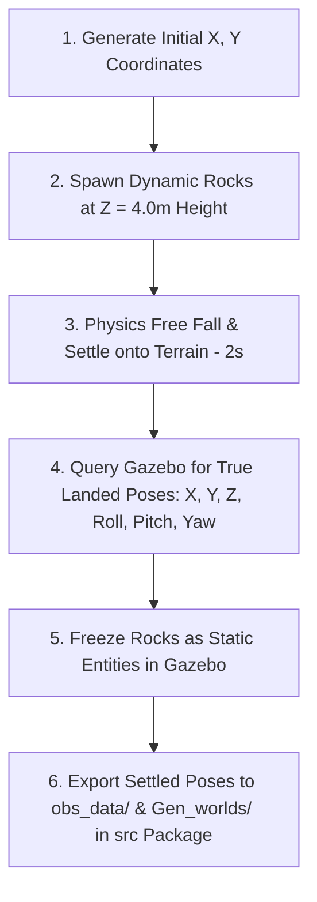

# ROAR Rock Generator, Spawner & World Fuser Package (`rock_generator`)

`rock_generator` is a modular ROS 2 package located in `simulation_ws/src/navMission_setup/rock_generator` designed for:
1. Generating obstacle datasets in NumPy (`.npy`) format.
2. Spawning dynamic rock models into Gazebo, letting gravity drop and settle them onto terrain mesh contours.
3. Capturing and exporting the **exact landed 3D poses ($X, Y, Z, \text{Roll}, \text{Pitch}, \text{Yaw}$)** back into `obs_data/` and `Gen_worlds/` inside the package source repository (`src/`).
4. Fusing obstacle datasets with base Gazebo world templates from the **`worlds`** package (`marsyard.world`) into standalone ready-to-use `.world` files in `Gen_worlds/`.

---

## 🌟 Settled Physics-Capture Workflow

Because exact ground heightmap data may not always be available initially, `rock_generator` uses a **Physics-Based Settling & Pose Capture** strategy:



1. **Initial Air Drop**: Rocks spawn dynamically at $Z=4.0\text{ m}$ height above the terrain.
2. **Free Fall & Settlement**: Physics runs for 2 seconds under gravity. Rocks fall, land on terrain mesh contours, and settle into their natural resting positions.
3. **Pose Capture & Freeze**: The spawner queries Gazebo for the exact settled position and orientation $(X_{\text{settled}}, Y_{\text{settled}}, Z_{\text{settled}}, \text{Roll}_{\text{settled}}, \text{Pitch}_{\text{settled}}, \text{Yaw}_{\text{settled}})$, freezes models as static entities in simulation, and **overwrites the initial dataset with true landed coordinates**.
4. **Source Directory Export**: Automatically saves updated datasets to:
   - `obs_data/obstacle_data.npy` *(Updated with exact landed Z, Roll, Pitch, Yaw)*
   - `obs_data/obstacle_data_settled_YYYYMMDD_HHMMSS.npy` *(Timestamped dataset)*
   - `Gen_worlds/marsyard_with_rocks.world` *(Fused world with exact settled poses)*
   - `Gen_worlds/marsyard_rocks_YYYYMMDD_HHMMSS.world` *(Timestamped fused world)*

---

## 🗺️ Future Height Map Integration Roadmap

The package architecture is fully decoupled, making it effortless to transition from the air-drop physics settling method to direct **Height Map (Elevation Grid)** sampling in the future:

### How to Transition to a Height Map:
1. **Direct $Z$-Sampling in `generator.py`**:
   - Replace the default $Z=4.0\text{ m}$ height with a direct query to your height map image/array:
     $$Z = \text{HeightMap}(X, Y)$$
   - The generated `.npy` file will already contain exact ground surface $Z$ values.
2. **Instant Static Spawning in `spawner.py`**:
   - Bypass the dynamic drop (`is_static=False`) and the 2-second fall delay.
   - Rocks will spawn **instantaneously as static models** (`is_static=True`) at their exact surface $(X, Y, Z)$ coordinates.
3. **Zero Structural Changes Required**:
   - The launch system, world fuser (`world_generator.py`), parameter CLI, and dataset directory layout will remain 100% identical.

---

## 🛠️ Package Parameters

| Parameter | CLI Flag | Default | Description |
| :--- | :--- | :--- | :--- |
| `world_name` | `--world-name` / `-w` | `marsyard.world` | Target Gazebo world file from `worlds` package |
| `density` | `--density` | `0.012` | Rock density in rocks per square meter |
| `collidable_ratio` | `--collidable-ratio` / `-c` | `0.5` | Ratio (0.0 to 1.0) of solid/collidable vs ghost/non-collidable rocks |
| `spacing` | `--spacing` / `-s` | `1.0` | Minimum physical distance (meters) between rock centers |
| `deadends` | `--deadends` | `False` | Enables barrier rock formation creating deadends |
| `obs_data_path` | `--obs-data-path` / `-o` | `obs_data/obstacle_data.npy` | Path for `.npy` obstacle dataset input/output |

---

## 🚀 Installation & Build Steps

From workspace root (`simulation_ws`):

```bash
cd ~/Desktop/ROAR/simulation_ws/
colcon build --packages-select marsyard worlds rock_generator
source install/setup.bash
```

---

## 💻 Workflows & Commands

### Workflow 1: Generate Initial NumPy Data Only (`obs_data/`)

Generates initial random obstacle placements based on parameters and saves `.npy` datasets inside `obs_data/`:

```bash
ros2 run rock_generator generate_obs --world-name marsyard.world --density 0.012 -c 0.5 -s 1.2
```

---

### Workflow 2: Test in Simulation & Capture Settled Landed Coordinates (Recommended)

Spawns rocks into live Gazebo, lets them fall under gravity to settle onto terrain mesh contours, freezes them as static obstacles, and **automatically updates `obs_data/` and `Gen_worlds/` with the exact landed coordinates $(X, Y, Z, \text{Roll}, \text{Pitch}, \text{Yaw})$**:

#### Step A: Launch Base World (From `worlds` package)
> ℹ️ **Note**: `launch_world.launch.py` includes and executes `launch_map.launch.py` directly from the **`worlds`** package.

```bash
# Option 1: Via rock_generator wrapper
ros2 launch rock_generator launch_world.launch.py world_name:=marsyard.world

# Option 2: Directly via worlds package
ros2 launch worlds launch_map.launch.py world:=marsyard.world
```

#### Step B: Spawn, Settle, and Capture Landed Positional Dataset
In **Terminal 2**:
```bash
ros2 run rock_generator spawn_rocks
```

---

### Workflow 3: Generate Standalone Fused `.world` File (`Gen_worlds/`)

Fuses the obstacle dataset in `obs_data/` with the `marsyard.world` base file from the `worlds` package into a ready-to-load `.world` file in `Gen_worlds/`:

```bash
ros2 run rock_generator generate_world --world-name marsyard.world
```

---

### Workflow 4: Full Automated Pipeline (Generate, Fuse & Live Spawn)

Runs initial generation, world fusion, and simulation spawning in one command:

```bash
ros2 launch rock_generator rock_generator.launch.py world_name:=marsyard.world density:=0.012 collidable_ratio:=0.5 spacing:=1.2
```

---

### Workflow 5: Launch Pre-Generated Fused World Directly in Gazebo

To directly launch a previously captured fused `.world` file from `Gen_worlds/`:

```bash
ign gazebo $(ros2 pkg prefix rock_generator)/share/rock_generator/Gen_worlds/marsyard_with_rocks.world
```

---

## 📁 Package Directory Layout

All generated files are saved directly inside your source repository (`src/navMission_setup/rock_generator`) so they can be easily shared via Git:

```text
navMission_setup/rock_generator/
├── setup.py                       <-- Package entry points & setup
├── package.xml
├── README.md                      <-- Package documentation
├── obs_data/                      <-- Settled obstacle datasets (.npy & .txt)
│   ├── obstacle_data.npy          <-- Latest dataset (updated with landed Z & rotations)
│   ├── obstacle_data_settled_YYYYMMDD_HHMMSS.npy
│   └── obstacle_data_info.txt
├── Gen_worlds/                    <-- Fused Gazebo .world files with settled poses
│   ├── marsyard_with_rocks.world
│   └── marsyard_rocks_YYYYMMDD_HHMMSS.world
├── launch/
│   ├── launch_world.launch.py     <-- Includes launch_map.launch.py from worlds package
│   ├── visualize_rocks.launch.py
│   └── rock_generator.launch.py
├── rock_generator/
│   ├── generator.py               <-- Generates initial .npy data
│   ├── world_generator.py         <-- Fuses dataset into .world XML
│   ├── spawner.py                 <-- Spawns, settles & exports captured poses
│   └── main.py                    <-- Unified CLI entry point
└── rocks_ws/                      <-- 3D Rock SDF models (rock_1 to rock_9)
```
